
<h1 align="center">基于javaweb的影院订票系统的设计与实现</h1>

## 简介
"基于JavaWeb的影院订票系统：提供电影选座、在线订票、论坛互动、公告管理和个人中心功能，角色分为管理员和用户，支持后台管理及多种支付方式"    --计算机毕业设计源码；毕设源码；java毕业设计源码

## 联系方式

<h3 align="center">获取完整代码与数据库文件 + 微信：deepguan QQ: 86050149 QQ群: 783742310</h3>

<h3 align="center">可帮忙远程部署 包运行成功！提供远程部署、修改代码、设计文档指导、代码讲解等服务！</h3>

## 功能介绍（完整见运行截图）
用户： 基本功能包括登录、注册、查看主页信息、并可以参与论坛讨论和评论功能。用户可在系统中浏览电影详情、进行选座及订票操作，并可以通过个人中心查看和编辑账户信息，包括充值和查看订单历史。用户还可以查看电影评论，管理员监督下的帖子的内容和回复，并具有互动的社区功能。

管理员： 管理员通过登录系统后可管理影院票务及用户信息，包括电影管理、公告发布、订单处理和帖子类型管理。管理员能够进行电影订单的退款和评论回复，确保内容的合规性。此外，管理员可使用系统后台执行电影和票价的更新、查看订单详情、发布及审核电影论坛和公告信息，并管理用户的个人资料与权限。

## 运行截图

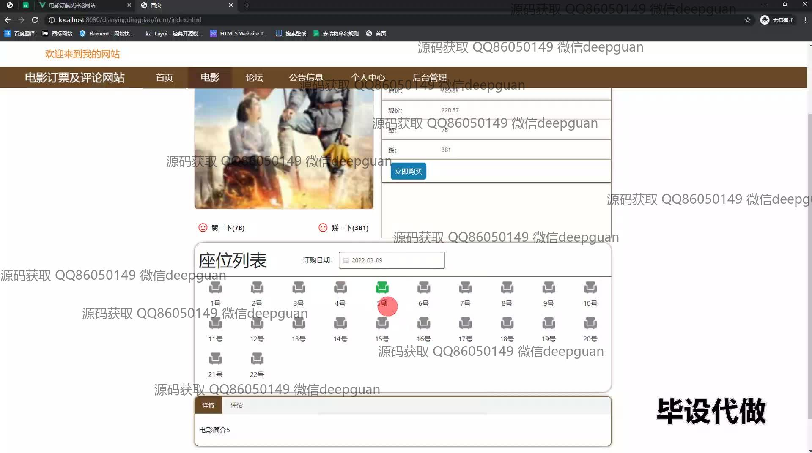
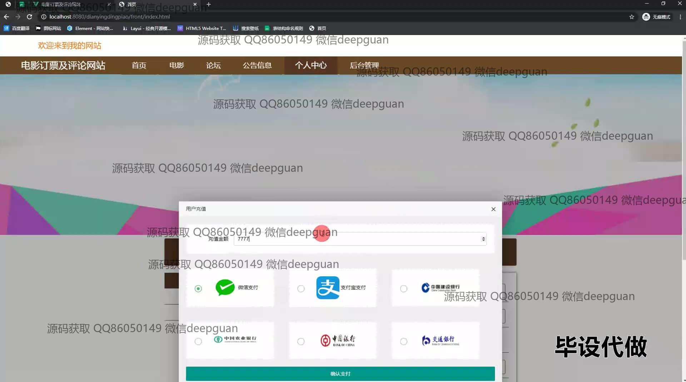
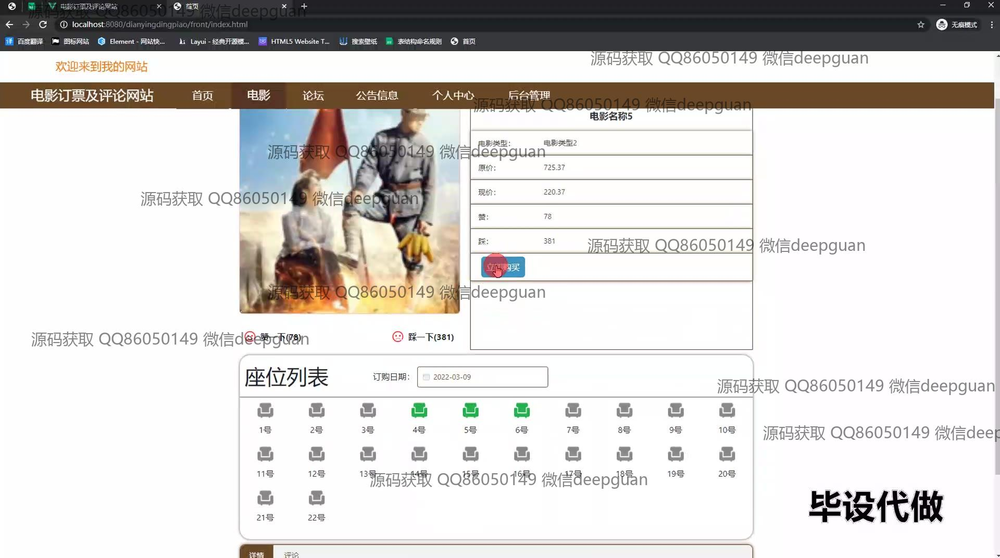
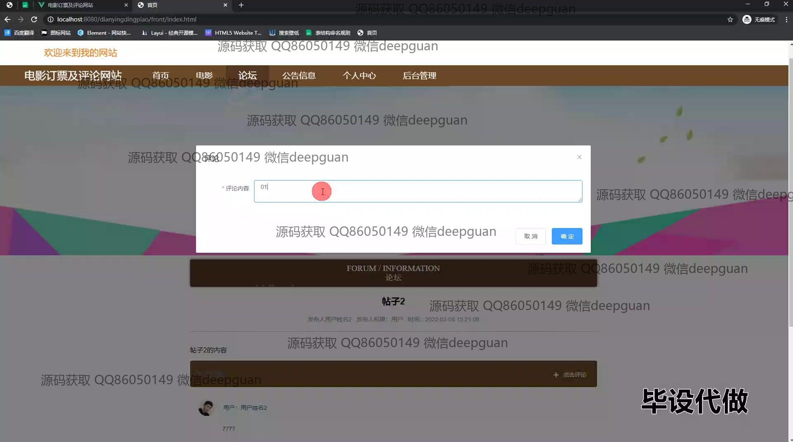
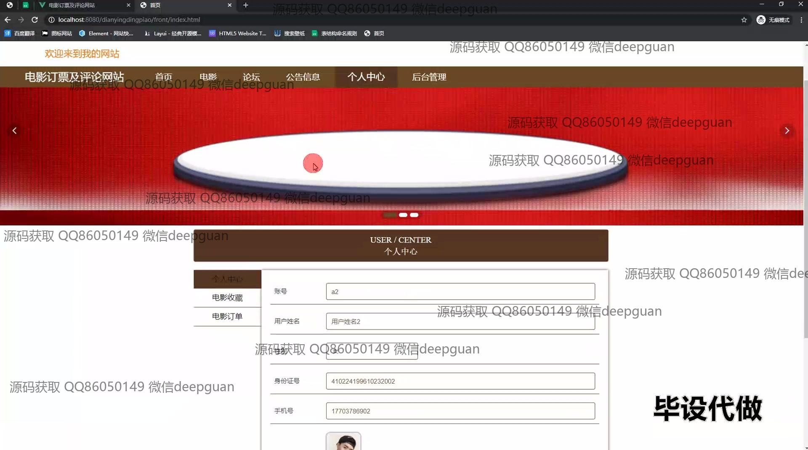
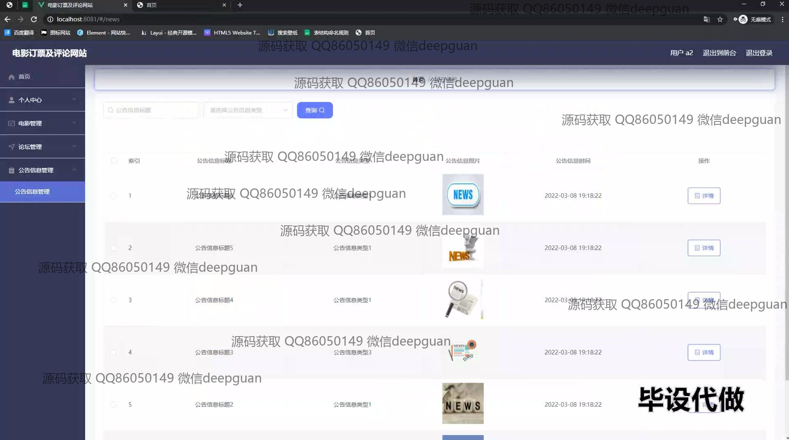
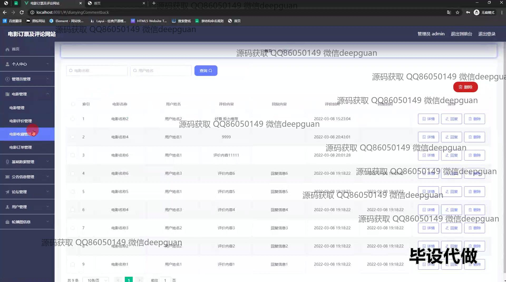
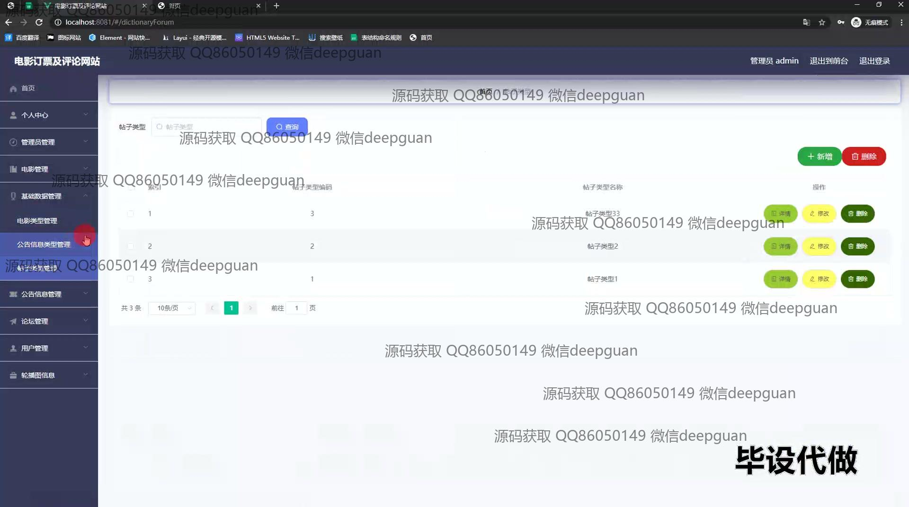
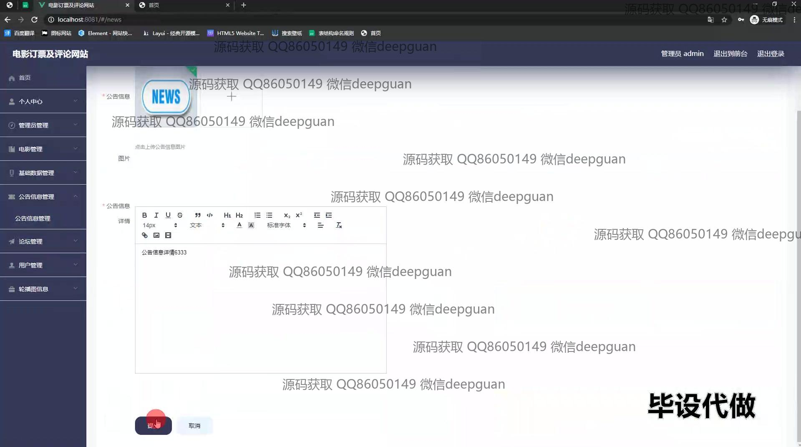
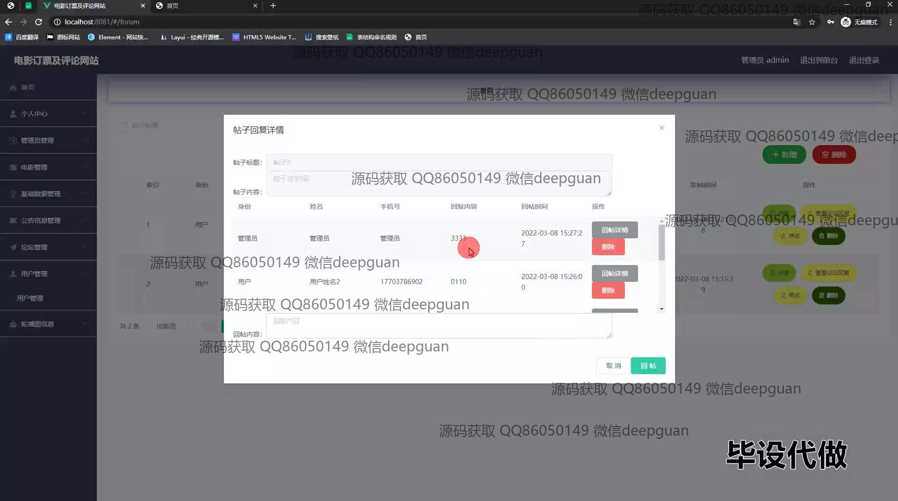

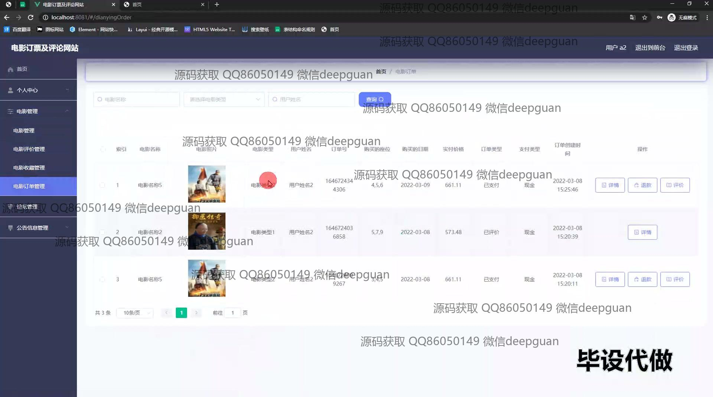
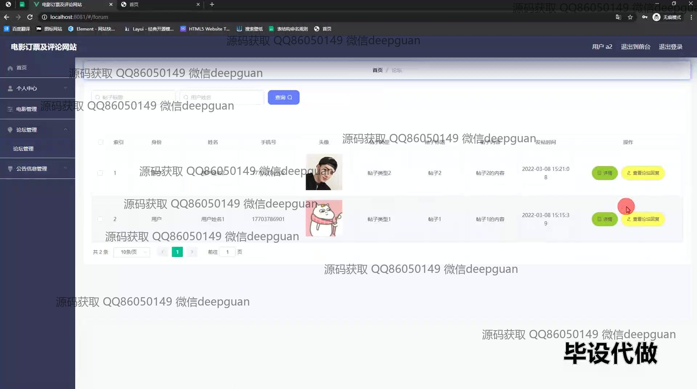

本代码来源于网络,仅供学习参考使用!

